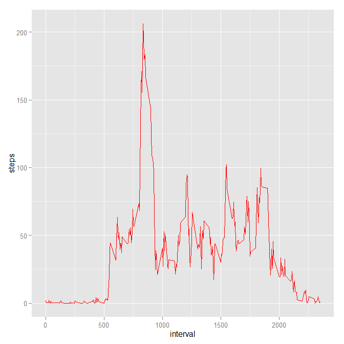
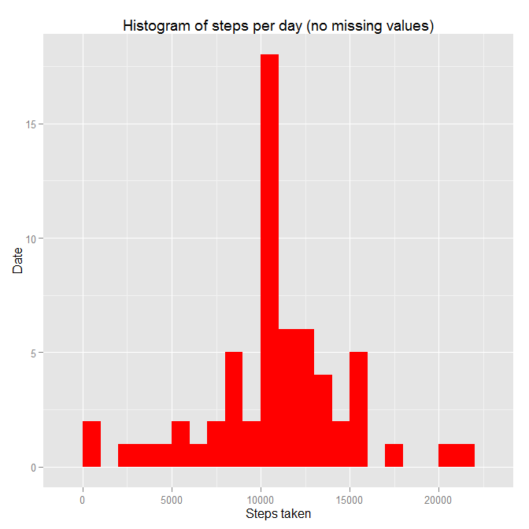
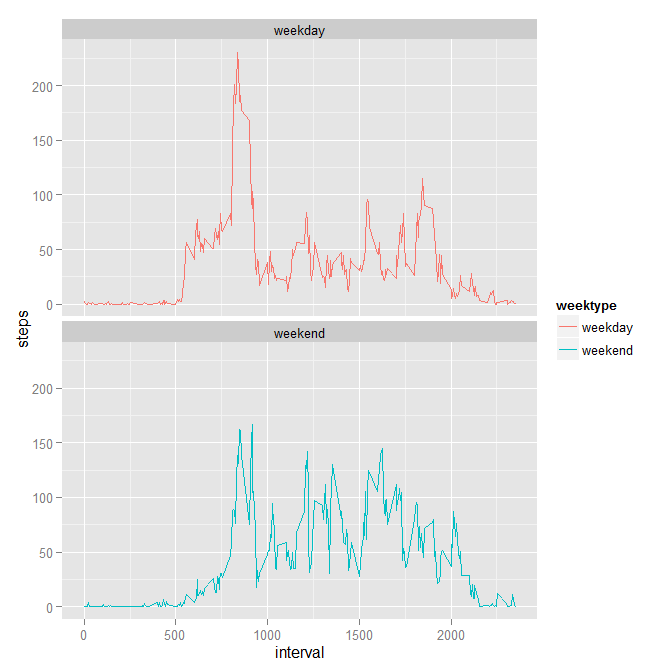

# Reproducible Research: Peer Assessment 1


## Loading and processing the data
>Show any code that is needed to
 1. Load the data (i.e. read.csv())
 2. Process/transform the data (if necessary) into a format suitable for your analysis

# First we need to load (or install) the packages needed to load and process the data


 ```r
 library(knitr)
 opts_chunk$set(echo = TRUE)

 library(dplyr)
 library(lubridate)
 library(ggplot2)
 ```

# Then we can read the data

 ```r
 data <- read.csv("activity.csv", header = TRUE, sep = ',', colClasses = c("numeric",   "character", "integer"))
 ```


It should show this dataset when printed:


 ```
 ##    steps       date interval
 ## 1     NA 2012-10-01        0
 ## 2     NA 2012-10-01        5
 ## 3     NA 2012-10-01       10
 ## 4     NA 2012-10-01       15
 ## 5     NA 2012-10-01       20
 ## 6     NA 2012-10-01       25
 ## 7     NA 2012-10-01       30
 ## 8     NA 2012-10-01       35
 ## 9     NA 2012-10-01       40
 ## 10    NA 2012-10-01       45
 ## 11    NA 2012-10-01       50
 ## 12    NA 2012-10-01       55
 ## 13    NA 2012-10-01      100
 ## 14    NA 2012-10-01      105
 ## 15    NA 2012-10-01      110
 ## 16    NA 2012-10-01      115
 ## 17    NA 2012-10-01      120
 ## 18    NA 2012-10-01      125
 ## 19    NA 2012-10-01      130
 ## 20    NA 2012-10-01      135
 ```

# Then we need to tidy the data

 First we set the data format to ymd using lubridate
 
 ```r
 data$date <- ymd(data$date)
  ```
 Check the data structure with str() and watch a few rows with head()
 
 ```r
 str(data)
 
 ## 'data.frame':    17568 obs. of  3 variables:
 ##  $ steps   : num  NA NA NA NA NA NA NA NA NA NA ...
 ##  $ date    : POSIXct, format: "2012-10-01" "2012-10-01" ...
 ##  $ interval: int  0 5 10 15 20 25 30 35 40 45 ...

 head(data)
 
 ##   steps       date interval
 ## 1    NA 2012-10-01        0
 ## 2    NA 2012-10-01        5
 ## 3    NA 2012-10-01       10
 ## 4    NA 2012-10-01       15
 ## 5    NA 2012-10-01       20
 ## 6    NA 2012-10-01       25
  ```
  Now we have our data ready to work

## What is mean total number of steps taken per day?

>For this part of the assignment, you can ignore the missing values in the dataset.

1. Calculate the total number of steps taken per day.
2. Make a histogram of the total number of steps taken each day.
3. Calculate and report the mean and median of the total number of steps taken per day.

We need to get and print a mean of the total number of steps taken each day.


1. First we get the total number of steps per day using dplyr and group by date:
  
  ```r
steps <- data %>%
  filter(!is.na(steps)) %>%
  group_by(date) %>%
  summarize(steps = sum(steps)) %>%
  print
  ```

   It results in a dataset like this:
  
  ```
 ## Source: local data frame [53 x 2]
 ## 
 ##          date steps
 ## 1  2012-10-02   126
 ## 2  2012-10-03 11352
 ## 3  2012-10-04 12116
 ## 4  2012-10-05 13294
 ## 5  2012-10-06 15420
 ## 6  2012-10-07 11015
 ## 7  2012-10-09 12811
 ## 8  2012-10-10  9900
 ## 9  2012-10-11 10304
 ## 10 2012-10-12 17382
 ## ..        ...   ...
  ```


2. Then we create the histogram and print it.

  
  ```r
  ggplot(steps, aes(x = steps)) +
  geom_histogram(fill = "red", binwidth = 1000) +
  labs(title = "Histogram of steps per day", x = "Steps taken", y = "Date")
  ```
  
   


3. Calculate the mean and median values (ignoring NA values) using the above dataset.

  1. Mean
      
      ```r
      mean_steps <- mean(steps$steps, na.rm = TRUE)
      
      mean_steps

      ```

      ```
      ## [1] 10766.19
      ```

  2. Median
      
      ```r
      median_steps <- median(steps$steps, na.rm = TRUE)
      
      median_steps
      ```

      
      ```
      ## [1] 10765
      ```
  The steps mean is 10766 and the steps median is 10765.

## What is the average daily activity pattern?

>What is the average daily activity pattern?
 1. Make a time series plot (i.e. type = "l") of the 5-minute interval (x-axis) and the average number of steps taken, averaged across all days (y-axis)
 2. Which 5-minute interval, on average across all the days in the dataset, contains the maximum number of steps?


1. First we calculate the average number of steps taken in each 5-minute interval per day, we'll group the dataset by interval, we'll exclude the NA values.
  
  ```r
  interval <- data %>%
  filter(!is.na(steps)) %>%
  group_by(interval) %>%
  summarize(steps = mean(steps))
  ```

2. Then we create the plot for the intervals and avg steps taken.
 
 ```r
  ggplot(interval, aes(x=interval, y=steps)) +
  geom_line(color = "red")
  ```
  

   

  
3. Now we use which.max() to find the interval with the most steps taken


  
  ```r
  interval[which.max(interval$steps),]
  ```

  
  ```
 ## Source: local data frame [1 x 2]
 ## 
 ##   interval    steps
 ## 1      835 206.1698
  ```

  We find that the interval 835 has the highest avg count of steps = 206.


## Imputing missing values

>Note that there are a number of days/intervals where there are missing values (coded as NA). The presence of missing days may introduce bias into some calculations or summaries of the data.

 1. Calculate and report the total number of missing values in the dataset (i.e. the total number of rows with NAs)
 2. Devise a strategy for filling in all of the missing values in the dataset. The strategy does not need to be sophisticated. For example, you could use the mean/median for that day, or the mean for that 5-minute interval, etc.
 3. Create a new dataset that is equal to the original dataset but with the missing data filled in.
 4. Make a histogram of the total number of steps taken each day and Calculate and report the mean and median total number of steps taken per day. Do these values differ from the estimates from the first part of the assignment? What is the impact of imputing missing data on the estimates of the total daily number of steps?

 What we need to do is follow this next steps:

1. We need to get a sum of all missing values.

  
  ```r
  sum(is.na(data$steps))
  ```

  
  ```
  ## [1] 2304
  ```
 We have 2304 missing values.


2. We will replace missing values with the average number of steps in the same 5 min interval and 3. We will store it in a new dataset.


  
  ```r
 data_full <- data
 nas <- is.na(data_full$steps)
 avg_interval <- tapply(data_full$steps, data_full$interval, mean, na.rm=TRUE,   
 simplify=TRUE)
 data_full$steps[nas] <- avg_interval[as.character(data_full$interval[nas])]
  ```

  
  We need to check if all NA's were replaced:
  
  ```r
sum(is.na(data_full$steps))
  ```

 ```
 ## [1] 0
 ```
We can see the number of missing values is now 0

4. We now need to calculate the number of steps taken in each 5 min interval per day.


  
  ```r
  steps_full <- data_full %>%
  filter(!is.na(steps)) %>%
  group_by(date) %>%
  summarize(steps = sum(steps)) %>%
  print
  ```

   A portion of the new dataset is as follows:
  
  ```
 ## Source: local data frame [61 x 2]
 ## 
 ##          date    steps
 ## 1  2012-10-01 10766.19
 ## 2  2012-10-02   126.00
 ## 3  2012-10-03 11352.00
 ## 4  2012-10-04 12116.00
 ## 5  2012-10-05 13294.00
 ## 6  2012-10-06 15420.00
 ## 7  2012-10-07 11015.00
 ## 8  2012-10-08 10766.19
 ## 9  2012-10-09 12811.00
 ## 10 2012-10-10  9900.00
 ## ..        ...      ...
  ```


Now we create a histogram of the new dataset.

  
  ```r
  ggplot(steps_full, aes(x = steps)) +
  geom_histogram(fill = "red", binwidth = 1000) +
  labs(title = "Histogram of steps per day (no missing values)", x = "Steps taken", y = "Date")
  ```
  
   


Finally we calculate the mean and median values of this new dataset.

  1. Mean
      
      ```r
      mean_steps_full <- mean(steps_full$steps, na.rm = TRUE)
      mean_steps_full
      ```

      
      ```
      ## [1] 10766.19
      ```

  2. Median
      
      ```r
      median_steps_full <- median(steps_full$steps, na.rm = TRUE)
      median_steps_full
      ```

      
      ```
      ## [1] 10766.19
      ```

      
We can observe that adding the missing values to the original data has caused both the mean and median values to be the same at 10766


## Are there differences in activity patterns between weekdays and weekends?

>For this part the weekdays() function may be of some help here. Use the dataset with the filled-in missing values for this part.
 1. Create a new factor variable in the dataset with two levels - "weekday" and "weekend" indicating whether a given date is a weekday or weekend day.
 2. Make a panel plot containing a time series plot (i.e. type = "l") of the 5-minute interval (x-axis) and the average number of steps taken, averaged across all weekday days or weekend days (y-axis). The plot should look something like the following, which was creating using simulated data:

1.  Use dplyr's mutate to create a new column, "weektype", and apply whether the day is weekend or weekday:.

  
  ```r
  data_full <- mutate(data_full, weektype = ifelse(weekdays(data_full$date) == "Saturday" | weekdays(data_full$date) == "Sunday", "weekend", "weekday"))
data_full$weektype <- as.factor(data_full$weektype)
head(data_full)
  ```

  
 This is what the new dataset should look like:
  
  ```
 ##       steps       date interval weektype
 ## 1 1.7169811 2012-10-01        0  weekday
 ## 2 0.3396226 2012-10-01        5  weekday
 ## 3 0.1320755 2012-10-01       10  weekday
 ## 4 0.1509434 2012-10-01       15  weekday
 ## 5 0.0754717 2012-10-01       20  weekday
 ## 6 2.0943396 2012-10-01       25  weekday
  ```

2. We need to calculate the average steps for each 5 min interval for weekdays and weekends and plot them

  
  ```r
  interval_full <- data_full %>%
  group_by(interval, weektype) %>%
  summarise(steps = mean(steps))
s <- ggplot(interval_full, aes(x=interval, y=steps, color = weektype)) +
  geom_line() +
  facet_wrap(~weektype, ncol = 1, nrow=2)
print(s)
  ```

 

   
  
  It seems that the observed subjects were more active in the day's early 5 min periods on weekends compared to weekdays, but were overall more active during the course of the whole day on weekdays compared to weekends, this is probaly because of labor activities during weekdays in comparison to rest periods on weekends.
  
  
